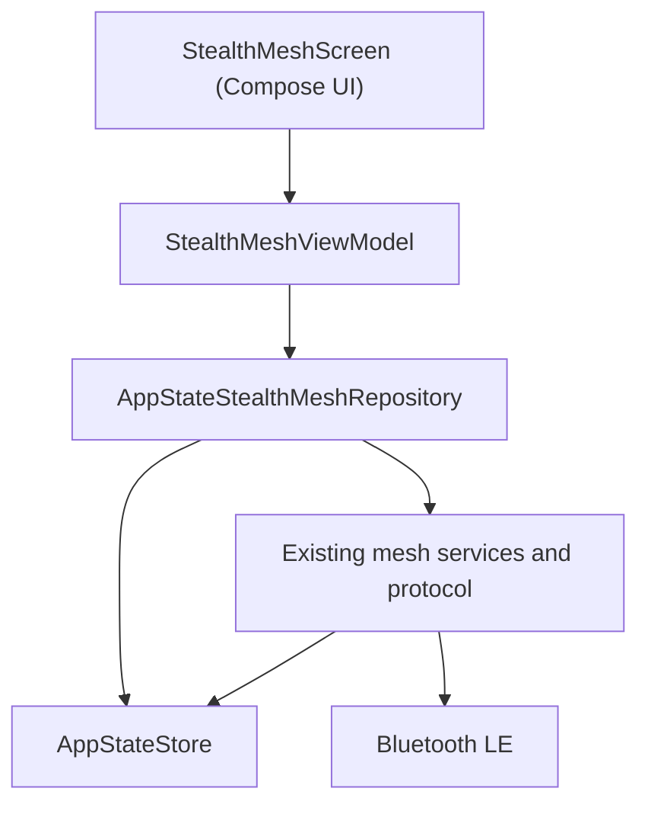

# StealthMesh

Offline-first Android mesh messaging for nearby devices.

StealthMesh is an Android messenger designed to let nearby phones discover one
another and exchange public text without Internet connectivity or a centralized
messaging server. The project adds a focused product, state, repository, and
Compose UI layer over the proven open-source
[bitchat Android](https://github.com/permissionlesstech/bitchat-android) local
mesh transport.

> **Release status:** `v0.2-alpha` is a developer alpha. It represents the
> reliability-first Nearby Mesh public and private text paths that have been
> physically verified; it is not the complete StealthMesh roadmap.

## Project goal

Offline mesh networking is complicated. StealthMesh aims to keep discovery,
transport, recovery, and message-state details beneath a small interface that
ordinary users can understand: see who is nearby, write a message, and keep the
conversation usable through normal disconnects and app restarts.

The current StealthMesh layer is more than a visual reskin. It defines an
immutable UI state model, maps the retained mesh state into product concepts,
provides deterministic public/private message presentation, reports real secure
session state, and keeps Compose separate from transport implementation details.

## Current v0.2-alpha features

- Native Android application built with Kotlin and Jetpack Compose
- Automatic nearby Bluetooth Low Energy discovery
- Direct local communication without Internet access
- No centralized messaging server required for local Nearby Mesh communication
- One public Nearby Mesh text conversation
- Nearby-peer and direct-link presentation
- Private peer-to-peer text conversations opened from nearby people
- Inherited Noise secure-session protection for verified private conversations
- Honest private-session states: establishing, encrypted, reconnecting,
  unavailable, and error
- Bidirectional text communication
- Deterministic timeline ordering and duplicate-free visible delivery in the
  physically tested scenarios
- Peer disappearance and automatic reconnection handling
- Process termination/relaunch recovery with identity preservation in the
  physically tested scenarios
- A thin repository, ViewModel, immutable state, and Compose chat shell
- Background mesh lifetime inherited from the retained transport architecture

## How it works

```text
Phone A
   ↕
Bluetooth LE / local mesh transport
   ↕
Phone B
```

For the verified Nearby Mesh path, the phones discover one another and exchange
public text or private text protected by an established inherited Noise session
locally over Bluetooth LE. No Internet connection is required.

## Architecture



- `StealthMeshScreen` renders immutable state and forwards user actions.
- `StealthMeshViewModel` owns public/private draft, selection, send, and session
  presentation state.
- `AppStateStealthMeshRepository` maps existing peer, public-message,
  private-message, and real Noise session state into StealthMesh models and
  sends text through the retained mesh API.
- `AppStateStore` remains the observable bridge from the proven networking
  implementation.
- The compatibility-sensitive BLE, routing, packet, fragmentation,
  deduplication, reconnect, and security internals remain inherited from the
  upstream transport base.

See [ARCHITECTURE.md](ARCHITECTURE.md) for the retained transport boundaries and
[UPSTREAM_BASE.md](UPSTREAM_BASE.md) for the exact upstream pin.

## Reliability-first development

Development advances through protected, reviewable checkpoints:

| Checkpoint | Protected outcome |
|---|---|
| 00 | Pinned upstream build baseline |
| 01 | Physical two-phone Bluetooth LE Golden Path |
| 02 | StealthMesh chat/domain layer integrated and physically validated |
| 03 | Private StealthMesh text conversations and secure-session recovery physically validated |

`checkpoint-03-private-chat` is the known-good product baseline for this alpha.
Feature work beyond it is intentionally paused during release preparation.

## Physical-device verification

Checkpoint 03 was exercised on two physical Android phones with synthetic test
messages. The verified scenarios include:

- mutual BLE discovery and direct links;
- text from phone A to phone B and phone B to phone A;
- exactly-once visible delivery within bounded tested scenarios;
- process termination, relaunch, automatic direct-link recovery, and continued
  bidirectional messaging;
- peer identity preservation through the tested restart flow;
- real established Noise state on both private-conversation endpoints;
- private text in both directions exactly once, before and after process
  termination/relaunch;
- public/private timeline separation;
- private-session reconnection without an explicit handshake fallback;
- the previously observed sequential-session contamination sequence, which did
  not reproduce in the Checkpoint 03 acceptance run;
- the real Compose composer, message bubbles, peer cards, and mesh status state;
  and
- peer disappearance followed by reconnection.

Private device identifiers, raw logs, and Mesh Lab evidence are deliberately not
published. Detailed sanitized results are in [TEST_REPORT.md](TEST_REPORT.md).

## Build requirements

- Git
- Android Studio or a command-line Android SDK installation
- JDK 21 (the repository pins `21.0.11` in `.java-version`)
- Android SDK platform 37 and Build Tools 37.0.0
- A physical Android device for meaningful BLE validation

The app compiles with SDK 37, targets SDK 37, and supports Android API 26 and
newer.

## Build on Windows

From the repository root:

```powershell
.\gradlew.bat assembleDebug
```

The universal developer APK is produced at:

```text
app/build/outputs/apk/debug/app-universal-debug.apk
```

The build also produces ABI-specific debug APKs in the same directory. These
are debug/developer artifacts, not signed Play Store releases.

## Install

After enabling USB debugging and connecting an authorized device, the universal
APK can be installed with:

```powershell
adb install -r app/build/outputs/apk/debug/app-universal-debug.apk
```

An APK may also be transferred to a compatible phone and installed manually,
subject to that phone's install-source settings. Android requests the required
Bluetooth and notification permissions at runtime.

## Current limitations

- This is an alpha release, not a production security-audited messenger.
- Private StealthMesh conversations currently cover text on the tested
  two-phone BLE topology; broader topology, attachment, and endurance coverage
  remains future work.
- The reserved premium UI redesign has not been integrated.
- Wi-Fi Aware acceleration is postponed and is not claimed as a completed
  StealthMesh feature.
- Full hardening, battery/endurance work, broader OEM coverage, and physical
  multi-hop testing remain future work.
- BLE behavior can vary by Android version and device manufacturer.
- The retained upstream project has a documented Windows/Robolectric test
  backlog outside the focused StealthMesh tests.

## Roadmap

- **v0.3:** integration of the reserved premium dark/light Compose design
- **Later:** optional Wi-Fi Aware acceleration, additional hardening, deeper
  battery tuning, broader physical-device coverage, and multi-hop validation

No delivery dates are promised for roadmap items.

## Open source and attribution

StealthMesh is a modified Android project built on substantial networking and
protocol work from
[permissionlesstech/bitchat-android](https://github.com/permissionlesstech/bitchat-android),
which is protocol-related to
[permissionlesstech/bitchat](https://github.com/permissionlesstech/bitchat).
The imported Android source is pinned and documented in
[UPSTREAM_BASE.md](UPSTREAM_BASE.md).

The repository preserves the upstream [GNU General Public License version 3](LICENSE.md)
text and attribution. The upstream README and license text historically used
conflicting public-domain/GPL language; until clarified upstream, StealthMesh
treats the retained code as GPL-3.0-covered. This is an engineering record, not
legal advice.

## Release notes

See [RELEASE_NOTES_v0.2-alpha.md](RELEASE_NOTES_v0.2-alpha.md) and the preserved
[v0.1-alpha notes](RELEASE_NOTES_v0.1-alpha.md).
